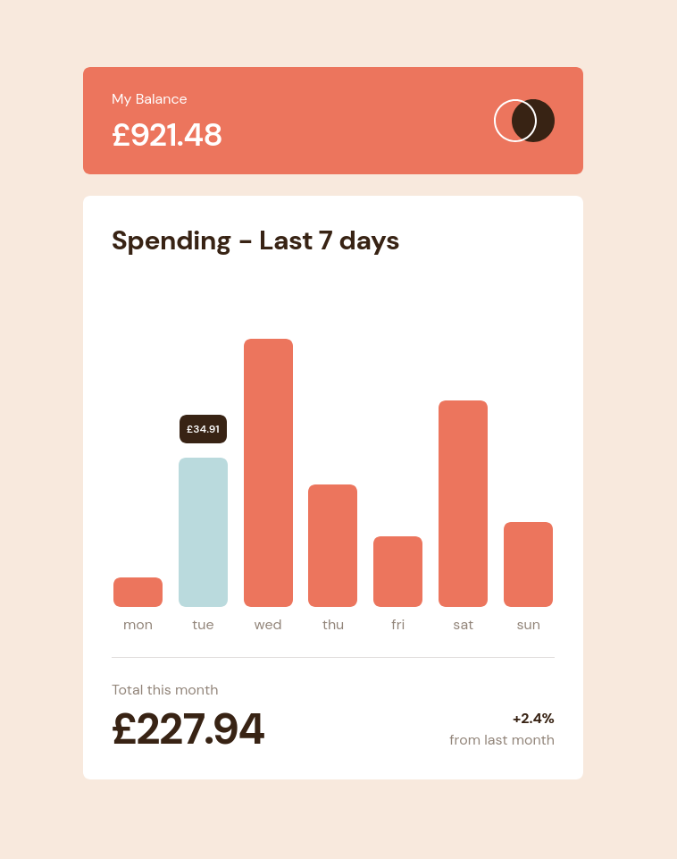

# Frontend Mentor - Expenses chart component solution

This is a solution to the [Expenses chart component challenge on Frontend Mentor](https://www.frontendmentor.io/challenges/expenses-chart-component-e7yJBUdjwt). Frontend Mentor challenges help you improve your coding skills by building realistic projects. 

## Table of contents

- [Overview](#overview)
  - [The challenge](#the-challenge)
  - [Screenshot](#screenshot)
  - [Links](#links)
- [My process](#my-process)
  - [Built with](#built-with)
  - [What I learned](#what-i-learned)
  - [Continued development](#continued-development)
- [Author](#author)

**Note: Delete this note and update the table of contents based on what sections you keep.**

## Overview

### The challenge

Users should be able to:

- View the bar chart and hover over the individual bars to see the correct amounts for each day
- See the current day’s bar highlighted in a different colour to the other bars
- View the optimal layout for the content depending on their device’s screen size
- See hover states for all interactive elements on the page
- **Bonus**: Use the JSON data file provided to dynamically size the bars on the chart

### Screenshot

### Links

- Solution URL: [Here](https://github.com/jambanix/frontendmentor_expenses-chart-component)
- Live Site URL: [Here](https://jambanix.github.io/frontendmentor_expenses-chart-component/)

## My process

### Built with

- [React](https://reactjs.org/) - JS library
- [TailwindCSS](https://tailwindcss.com/) - Tailwind CSS

### What I learned

This was a good challenge and a problem I hadn't come across before. It was a bit of a headache trying to get the heights on the chart container and respective bars to marry up, and took a lot of tweaking; in the real world I would no doubt use a chart library, but this was still good to get an understanding of things

### Continued development

I will continue doing the challenges to gain more exposure to different problems I may encounter in the real world

## Author

- Frontend Mentor - [@jambanix](https://www.frontendmentor.io/profile/jambanix)
- Github - [jambanix](https://www.github.com/jambanix)
